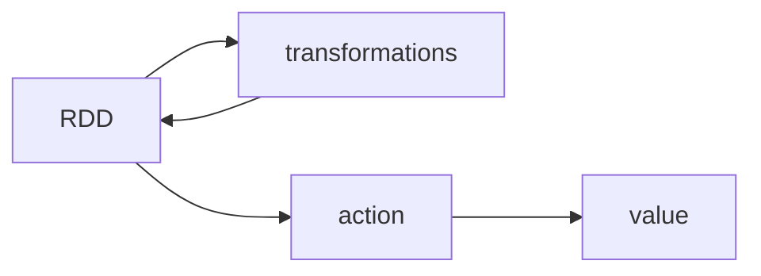
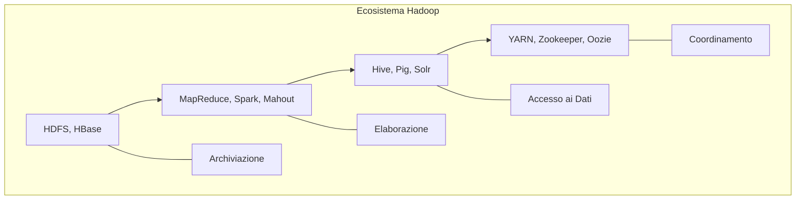
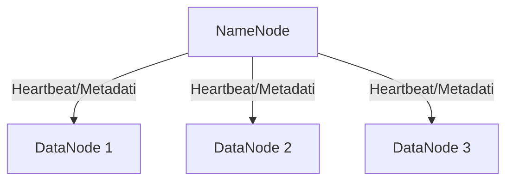
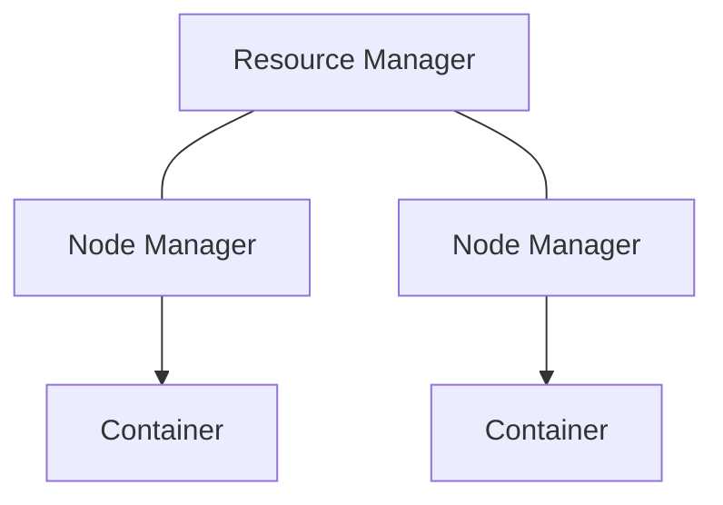
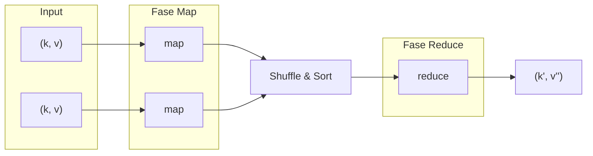

#### Spark

Un motore di elaborazione dati veloce e in-memory compatibile con Hadoop.

##### Motivazione

- L'esecuzione di MapReduce per **attività iterative**, **query interattive** o **streaming** richiederebbe accessi multipli al disco (**l'I/O è LENTO!**).  
    
- **Soluzione**: Mantenere i dati nella memoria principale per velocità ed efficienza.

##### Cos'è Spark?

- **Grafi di esecuzione generali**: È solo un motore di elaborazione dati.  
    
- **Prestazioni**: Fino a **10 volte** più veloce su disco, **100 volte** in memoria.
- **Usabilità**: **2-5 volte** meno codice rispetto a MapReduce, con API ricche (Scala, Java, Python, R) e una shell interattiva.
- **Architettura**:
    - **Nessun DFS richiesto**: Funziona con HDFS, NoSQL o sistemi esistenti (Hadoop non è un prerequisito).
    - **Gestione Flessibile del Cluster**: Funziona con YARN, Mesos o in modalità Standalone.
    - **Librerie Ampie**: Include Spark SQL, Streaming, MLlib e GraphX.

###### Obiettivo

- Fornire astrazioni di memoria distribuita per i cluster mantenendo le proprietà di MapReduce: **tolleranza ai guasti**, **località dei dati** e **scalabilità**.
- **Soluzione**: Potenziare il modello di flusso di dati con i **Resilient Distributed Datasets (RDD)**.

| Caratteristica | Hadoop MapReduce | Apache Spark |
| :--- | :--- | :--- |
| **Archiviazione** | Solo disco | In memoria o su disco |
| **Operazione** | Map e Reduce | Map, Reduce, Join, Sample, ecc. |
| **Modalità esecuzione** | Batch | Batch, interattiva, streaming |
| **Linguaggi di progr.** | Java | Scala, Java, R e Python |

##### Concetti Base

**Come usiamo Spark?**

- **Useremo pyspark, l'interfaccia Python per Spark**
    - Applicazione interattiva - **questo corso (con i Jupyter Notebook)**
    - Applicazione standalone

**Spark è un’applicazione composta da un driver, un cluster manager e uno o più executor**

- **Driver**
    - coordina l’esecuzione della computazione (DAG).
- **Master o cluster manager**
    - Gestisce le risorse del cluster composto da worker e assegna risorse all’applicazione
    - Esegue le computazini sequenziali e unisce i sub risultati
- **Executor Worker**
    - Esegue operazioni parallele
    - Eseguiti nei nodi di calcolo o in thread locali

**Inizializzazione**

- Lo SparkContext è il punto di ingresso principale per le funzionalità di Spark.
    - Indica a Spark come e dove accedere a un cluster.
    - **pyspark** lo crea automaticamente per te.
- Qualsiasi programma Python (o notebook Jupyter) dovrebbe utilizzare un costruttore SparkContext per funzionare.
- Questo ci permette di creare nuovi RDD.
    
    ```python
    conf = SparkConf().setMaster(master).setAppName("My App")
    ```
    
- dove master è l'URL di un cluster Spark, Mesos o YARN, oppure una stringa speciale "local\[\*\]" per l'esecuzione in modalità locale.

> `*` significa utilizzare tutti i thread disponibili come esecutori. Potrebbe essere indicato il numero da utilizzare.

**SparkContext (sc) viene creato nel driver**  
\- **Utilizzando lo sc, viene stabilita una connessione con il cluster manager.**  
\- Una volta connessi, vengono richiesti gli esecutori.  
\- Un esecutore è un processo che esegue il calcolo e memorizza i dati.  
\- Il driver invia il codice e le attività (task) agli esecutori.


> Alcune osservazioni:
> 
> - **Ogni programma ha i propri esecutori**  
>     \- **Vantaggio: Isolamento**  
>     \- **Svantaggio: La condivisione dei dati non è possibile**
> - **Un worker può avere più di un esecutore**  
>     \- Da diversi programmi/applicazioni  
>     \- A seconda del numero di core e della memoria RAM necessaria
> - **Quando si utilizza YARN, un esecutore viene eseguito in un container.**

##### RDD

- **Definizione**: Una raccolta di elementi tollerante ai guasti che può essere gestita in parallelo e può essere memorizzata nella cache per un riutilizzo futuro. Gli RDD vengono ricostruiti automaticamente in caso di guasto.
- **Una raccolta distribuita di oggetti**
    - **Immutabili** una volta creati
        - Una volta creato un RDD, i suoi dati non possono essere modificati.
        - **Ogni operazione crea un nuovo RDD.**
    - Il **Lineage** degli RDD viene mantenuto per garantire la tolleranza ai guasti.
        - Spark tiene traccia della sequenza di trasformazioni utilizzate per costruire ogni RDD.
        - **Questa cronologia forma un grafo diretto (DAG)** delle operazioni.
- Può contenere oggetti Python, Java o Scala! Incluse le tue classi.
- Esistono tre modi per creare RDD:
    - **Parallelizzare** una raccolta esistente nel programma driver.
    - **Fare riferimento** a un set di dati in un sistema di archiviazione esterno (HDFS, Amazon S3, HBase, ecc.) o RDD impilati.
    - **Trasformare** un RDD esistente.

Creazione di RDD da raccolte Python:

```python
>>> data = [1, 2, 3, 4, 5]
>>> data
# [1, 2, 3, 4, 5]

>>> rDD = sc.parallelize(data, 4)
>>> rDD
# ParallelCollectionRDD at parallelize at PythonRDD.scala:229
```

> **sc.parallelize() è un'operazione lazy. Non c'è alcun tipo di calcolo. Spark salva semplicemente come creare l'RDD con 4 partizioni.**

| Passaggio | Parallelizzazione delle raccolte locali |
| :--- | :--- |
| 1.  | Spark prende la raccolta locale memorizzata sul programma driver. |
| 2.  | Suddivide i dati in partizioni. |
| 3.  | Tali partizioni sono distribuite tra esecutori/worker. |
| 4.  | Il risultato è un RDD che può essere elaborato in parallelo. |

Creazione di RDD da un sistema di archiviazione esterno:

- È possibile fare riferimento a HDFS, Amazon S3, HBase,…
- Se si utilizza ’\*’, è possibile caricare tutti i file in una cartella.

> **sc.textFile() è anch'essa un'operazione lazy.**

```python
>>> distFile = sc.textFile("README.md", 4)
>>> distFile
MappedRDD at textFile at NativeMethodAccessorImpl.java:-2
```

- Spark partiziona automaticamente il file o la raccolta.
    - Questo è il massimo grado di parallelismo che possiamo raggiungere.
    - È possibile utilizzare `rdd.getNumPartitions()`.


**RDD - Esempio semplice**

- La maggior parte degli operatori Spark utilizza funzioni di ordine superiore(`Ricevono una o più funzioni come argomenti (parametri). Restituiscono una funzione come risultato`).
- Ad esempio, per filtrare le righe da un RDD, possiamo utilizzare funzioni anonime/lambda:
    
    ```python
    >>> lines = sc.textFile("README.md")
    >>> pythonLines = lines.filter(lambda line: "Python" in line)
    >>> pythonLines.first()
    u'## Interactive Python Shell'
    ```
    
    > **Tutte le operazioni sugli RDD vengono eseguite in parallelo. Quindi, un'istruzione line.contains("Python") viene inviata a tutti i worker.**
    
- **Senza funzioni lambda:**
    
    ```python
    def hasPython(line):
        return "Python" in line
    pythonLines = lines.filter(hasPython)
    ```
    

##### Trasformazioni e Azioni



**Trasformazioni Base**

- `map(lambda x: x+2)`
    
    
    
    ```python
    >>> rdd = sc.parallelize()
    >>> rdd.map(lambda x: x * 2)
    # RDD: [1, 2, 3, 4] → [2, 4, 6, 8]
    ```
    
- `filter(solo giallo)`  
    
    
    ```python
    >>> rdd.filter(lambda x: x != 1)
    # RDD: [1, 2, 3, 4] → [2, 3, 4]
    
    >>> rdd.filter(lambda x: x % 2 == 0)
    # RDD: [1, 2, 3, 4] → [2, 4]
    ```
    
    > **I worker utilizzano la funzione di input sull'RDD di input.**
    
- `distinct()`  
    
    
    ```python
    >>> rdd2 = sc.parallelize()
    >>> rdd2.distinct()
    # RDD: [1, 4, 2, 2, 3] → [1, 4, 2, 3]
    ```
    
- Differenza tra `map()` e `flatMap()`  
    
    
    ```python
    >>> rdd = sc.parallelize()
    >>> rdd.Map(lambda x: [x, x+5])
    # RDD: [1, 2, 3] → [[1, 6], [2, 7], [3, 8]]
    ```
    
    ```python
    >>> rdd.flatMap(lambda x: [x, x+5])
    # RDD: [1, 2, 3] → [1, 6, 2, 7, 3, 8]
    ```
    
    ```python
    >>> lines = sc.parallelize(["hello world", "hi"])
    >>> words = lines.flatMap(lambda line: line.split(" "))
    # RDD: ["hello world", "hi"] → ["hello", "world", "hi"]
    ```
    
- **Pseudo-set**
    
    - È possibile utilizzare operazioni di tipo set sugli RDD.
        - **Gli RDD non sono realmente strutture set.**
        - **Tutti gli RDD coinvolti devono essere dello stesso tipo.**  
            

**Azioni**

- **Azioni: Restituiscono un risultato al nodo driver**

| Azione | Significato |
| :--- | :--- |
| `reduce(func)` | Aggrega gli elementi del dataset utilizzando una funzione *func* (che accetta due argomenti e ne restituisce uno). La funzione deve essere commutativa e associativa in modo che possa essere calcolata correttamente in parallelo. |
| `collect()` | Restituisce tutti gli elementi del dataset come array nel programma driver. Questo è utile solitamente dopo un filtro o un'altra operazione che restituisce un sottoinsieme dei dati sufficientemente piccolo. |
| `count()` | Restituisce il numero di elementi nel dataset. |
| `first()` | Restituisce il primo elemento del dataset (simile a `take(1)`). |
| `take(n)` | Restituisce un elenco dei primi n elementi di un RDD. |
| `takeOrdered(n , key=func)` | Restituisce n elementi in ordine crescente o nell'ordine determinato dalla funzione opzionale func. |
| `foreach(func)` | Applica la funzione func a ciascun elemento dell'RDD. Non restituisce nulla. Potrebbe essere utile per inserire dati in un database. |

- `reduce(add)`  
    
    
    ```python
    >>> rdd = sc.parallelize()
    >>> rdd.reduce(lambda a, b: a * b)
    # Valore: 6
    ```
    
    ```python
    >>> rdd.take(2)
    # Valore: [1, 2] # come lista
    ```
    
    ```python
    >>> rdd.collect()
    # Valore: [1, 2, 3] # come lista
    ```
    
    ```python
    >>> rdd = sc.parallelize()
    >>> rdd.takeOrdered(3, lambda s: -1 * s)
    # Valore: [5, 3, 2] # come lista
    
    ```
    
- `count()`
    
      
    *Fonte: Dirk Van den Poel. Spark: The new kid on the block (2014)*
    
    ```python
    badLinesRDD = inputRDD.filter(lambda x: ["error", "warning"] in x)
    print(f"Questo file ha {badLinesRDD.count()} righe con problemi")
    ```
    
    ```python
    print("Prime 10 righe: ")
    for line in badLinesRDD.take(10):
      print(line)
    ```
    
- `Lineage -> distinct().cartesian(rdd2.distinct())`  
    **RDD Lineage: tiene traccia di tutte le trasformazioni utilizzate per la tolleranza ai guasti**
    
    ```python
    rdd3 = rdd1.distinct().cartesian(rdd2.distinct())
    ```
    
    ```mermaid
    graph TD
        R1[RDD 1] -- "distinct()" --> T1[Temp RDD 1]
        R2[RDD 2] -- "distinct()" --> T2[Temp RDD 2]
        T1 --cartesian()--> R3
        T2 --cartesian()--> R3[Grafo di Lineage RDD3]
    ```
    

**Trasformazioni di RDD Chiave-Valore**

- Come Hadoop MapReduce, Spark supporta coppie chiave-valore.
- Ogni elemento di un RDD deve essere una tupla (chiave, valore).
    
    ```python
    >>> rdd = sc.parallelize([(1, 2), (3, 4)])
    # RDD: [(1, 2), (3, 4)]
    ```
    

| Trasformazione | Significato |
| :--- | :--- |
| `groupByKey()` | Restituisce un nuovo RDD di tuple (k, iterable(v)). **Attenzione: richiede uno Shuffle!** |
| `reduceByKey(func)` | Restituisce un nuovo RDD di tuple (k, v) dove i valori di ogni chiave k sono aggregati utilizzando la funzione func. Questa funzione deve prendere due elementi di tipo v e restituire lo stesso tipo. |
| `sortByKey([ascending])` | Restituisce un nuovo RDD di tuple (k, v) che è stato ordinato (per impostazione predefinita, in ordine crescente). |

- `groupByKey()`  
    
    
- `reduceByKey(x+y)`  
    
    
    ```python
    >>> rdd = sc.parallelize([(1, 2), (3, 4), (3, 6)])
    >>> rdd.reduceByKey(lambda a, b: a + b)
    # RDD: [(1, 2), (3, 4), (3, 6)] → [(1, 2), (3, 10)]
    ```
    
- `sortByKey()`
    
    ```python
    >>> rdd2 = sc.parallelize([(1,'a'), (2,'c'), (1,'b')])
    >>> rdd2.sortByKey()
    # RDD: [(1,'a'), (2,'c'), (1,'b')] → [(1,'a'), (1,'b'), (2,'c')]
    ```
    

**Trasformazioni SQL tipo Join**

- I join SQL consentono di combinare due tabelle in base a una colonna correlata.
    - Negli RDD, le chiavi vengono utilizzate per il join.

| Trasformazione | Significato |
| :--- | :--- |
| `join(rdd)` | Inner join tra RDD, dove la chiave deve essere presente in entrambi gli RDD. |
| `leftOuterJoin(rdd)` | Unisce gli elementi di due RDD dove la chiave deve essere presente nel secondo RDD. |
| `rightOuterJoin(rdd)` | Unisce gli elementi di due RDD dove la chiave deve essere presente nel primo RDD. |
| `fullOuterJoin(rdd)` | Unisce gli elementi di due RDD dove la chiave deve essere presente in uno qualsiasi dei due RDD. |

- `join(rdd)`
    
    ```python
    >>> people = sc.parallelize([("Lam", 30), ("Direnc", 32), ("Rebecca", 25), ("Edwina", 24)])
    >>> hobbies = sc.parallelize([ ("Lam", ["Triathlon", "Running", "Cycling"]), ("Direnc", ["Lifting", "Running", "Reading"]), ("Rebecca", ["Singing", "Dancing"]), ("Edwina", ["Running", "Music"])])
    >>> people.join(hobbies).collect()
    # [('Direnc', (32, ['Lifting', 'Running', 'Reading'])), ('Lam', (30, ['Triathlon', 'Running', 'Cycling'])), ('Edwina', (24, ['Running', 'Music'])), ('Rebecca', (25, ['Singing', 'Dancing']))]
    ```
    

###### Azioni aggiuntive per RDD chiave-valore

| Azione | Significato |
| :--- | :--- |
| `countByKey()` | Conta il numero di elementi per ogni chiave. Restituisce un dizionario. |
| `collectAsMap()` | Raccoglie l'RDD come un dizionario, ma fornisce solo uno dei valori. |
| `lookup(key)` | Restituisce il valore associato a una determinata chiave. |

- `countByKey()`  
    
    
    > **Attenzione! Questa è un'azione! Il risultato deve rientrare nel driver.**  
    > *Fonte: Dirk Van den Poel. Spark: The new kid on the block (2014)*
    
    ```python
    >>> rdd = sc.parallelize([(1, 2), (3, 4), (3, 6)])
    >>> rdd.countByKey()
    # Valore: {1: 1, 3: 2}
    ```
    
    ```python
    >>> rdd.collectAsMap()
    # Valore: {1: 2, 3: 6}
    ```
    
    ```python
    >>> rdd.lookup(3)
    # Valore: [4, 6]
    ```
    

###### Caching

- **Il caching degli RDD non avviene per impostazione predefinita!!**
    
    ```python
    lines = sc.textFile("...", 4)
    comments = lines.filter(condition)
    print(lines.count(), comments.count())
    ```
    

**Spark ricalcola l'RDD `lines`:**

- Leggendo i dati ANCORA.
- Eseguendo l'aggiunta per ogni partizione.
- Combinando i risultati intermedi nel driver.

**Soluzione: Memorizzare nella cache l'RDD `lines`**

```python
lines = sc.textFile("...", 4)
lines.cache()
comments = lines.filter(condition)
print(lines.count(), comments.count())
```

**Dettagli sul caching degli RDD**

- Esistono diversi livelli di persistenza/caching: Solo Memoria, Memoria e Disco, Solo Disco, …
- **In Python, tutti gli oggetti vengono serializzati con la libreria pickle.**

##### Concetti Avanzati


###### Variabili Condivise

- **Variabili condivise in Spark**
    
    - **Spark invia funzioni e variabili globali** a tutti gli esecutori per ogni attività, e non c'è comunicazione tra gli esecutori.
    - Qualsiasi modifica apportata alle variabili globali dagli esecutori non è visibile nel driver!
- **Variabili broadcast (Broadcast variables):**
    
    - Variabili **in sola lettura** che vengono inviate in modo efficiente a tutti gli esecutori (memorizzate nella cache).
    - Memorizzate nei worker, in modo che possano essere utilizzate da una o più operazioni Spark. Vengono inviate una sola volta, non per ogni attività.
- **Accumulatori:**
    
    - Aggregano i valori degli esecutori nel driver.
    - Solo il driver può accedere ai valori di queste variabili.
    - **Per le attività, gli accumulatori sono in sola scrittura.**
    - Tipicamente utilizzati per implementare contatori efficienti e addizioni parallele.

###### Esempio di Broadcast

Immagina di avere una grande tabella di ricerca (look-up table).

```python
>>> rdd = sc.parallelize()
>>> look_up_table = {1: "a", 2: "b", 3: "c", 4: "d"}
```

> **Supponiamo che questa sia MOLTO GRANDE!**

- **Senza broadcast** (Inefficiente)
    
    ```python
    # Come variabile globale, viene inviata ai worker per ogni attività!
    >>> rdd.map(lambda v: look_up_table[v]).collect()
    # ['a', 'b', 'c', 'd']  -> Inefficiente
    ```
    
- **Variabile broadcast**
    
    ```python
    # Come variabile broadcast, viene inviata una sola volta!
    >>> look_up_table_bc = sc.broadcast(look_up_table)
    >>> rdd.map(lambda v: look_up_table_bc.value[v]).collect()
    # ['a', 'b', 'c', 'd']  -> Utilizzo della variabile broadcast: stesso risultato, ma distribuzione efficiente
    ```
    

###### Esempio di Accumulatori

Utilizzo degli accumulatori per contare quante volte viene eseguita una funzione.

```python
>>> accum = sc.accumulator(0)
>>> rdd = sc.parallelize()
def f(x):
    global accum
    accum += 1
>>> rdd.foreach(f)
>>> accum.value
# 4
```

> **Gli accumulatori funzionano bene con le azioni.**

Contare le righe vuote in un file.

```python
>>> quixote_rdd = sc.textFile("data/quixote.txt")
>>> blank_lines = sc.accumulator(0)
def extract_words_blanklines(line):
    global blank_lines
    if line == "":
        blank_lines += 1
    return line.split(" ")
>>> words_quixote = quixote_rdd.flatMap(extract_words_blanklines)
>>> words_quixote.count()
# 437863
>>> blank_lines.value
# 6820
```

> Il valore di `blank_lines` sarà sempre corretto?  
> **Gli accumulatori sulle trasformazioni potrebbero non essere ideali!**

###### Partizioni

| Trasformazione | Significato |
| :--- | :--- |
| `mapPartitions(func)` | Applica func a ogni partizione. Riceve/restituisce un iteratore. |
| `mapPartitionsWithIndex(func)` | Applica func a ogni partizione con indice. |
| `foreachPartition(func)` | Applica func a ogni partizione senza restituire nulla. |

**Attività: Calcolo della media con `map()` vs `mapPartitions()`**

- **Con `map()`**
    
    ```python
    >>> rdd = sc.parallelize()
    >>> sum_count = rdd.map(lambda num: (num, 1))\
        .reduce(lambda x, y: (x + y, x + y))
    >>> sum_count
    # (28, 7)
    >>> sum_count / sum_count
    # 4.0
    ```
    
- **Con `mapPartitions()`**
    
    ```python
    def partition_counter(nums):
        sum_count = [0, 0]
        for num in nums:
            sum_count[0] += num
            sum_count[1] += 1
        return [sum_count]
    >>> rdd.mapPartitions(partition_counter)\
        .reduce(lambda x, y: (x + y, x + y))
    # (28, 7)
    ```
    
    > **Il pre-calcolo può far risparmiare molto in alcuni casi!**
    

###### RDD Numerici

- Spark fornisce alcuni metodi integrati per generare alcune statistiche descrittive di un RDD numerico.
- Es. `stats()`, `count()`, `mean()`, `max()`, ecc.
    
    ```python
    >>> a = sc.parallelize()
    >>> stat = a.stats()
    >>> stat
    # Valore: (count: 7, mean: 4.0, stdev: 2.0, max: 7.0, min: 1.0)
    >>> a.count()
    # Valore: 7
    >>> a.mean()
    # Valore: 4.0
    ```
    
    > **L'utilizzo di `stats()` è più efficiente rispetto a eseguire `mean()` e `std()` separatamente. Richiede un singolo passaggio attraverso l'RDD.**
    

###### Leggere/Scrivere da/su file

- **Caricare e salvare dati in Spark**
    - **Usiamo `sc.textFile`** per leggere da un filesystem, un singolo file o un'intera directory:
        
        ```python
        input = sc.textFile("file:///home/pszit/spark/")
        ```
        
        > **ATTENZIONE: Tutti i nodi dovrebbero essere in grado di accedere al file!**
        
    - **Usando `wholeTextFiles()` otteniamo i nomi dei file come chiave e il contenuto come valori:**
        
        ```python
        input = sc.wholeTextFiles("file:///home/pszit/spark/")
        ```
        
    - **Scrittura di file di testo**
        
        ```python
        result.saveAsTextFile(outfile)
        ```
        
        - L'output non è un file, ma una directory!

##### Funzionamento Interno

**Due tipi di trasformazioni**

- Dipendenze **Strette (Narrow)**
    - Ogni partizione contribuirà a una sola partizione di output.  
        
- Dipendenze **Ampie (Wide)**
    - Le partizioni di input contribuiscono a molte partizioni di output.
    - Ci sarà uno shuffle, scambiando partizioni/dati attraverso un cluster.
    - Definiscono gli Spark Stage.
    - Es. sort, reduceByKey, groupByKey, join.  
        

Spark crea un **Grafo Aciclico Diretto (DAG)** per ottimizzare l'esecuzione.  


- Spark unisce le operazioni di uno stage come un'unica attività (task).
    
    ```python
    input = sc.parallelize()
    input\
    # Stage 1
    .filter(lambda x: x < 2)\
    .map(lambda x: (x, x))\
    # Stage 2
    .groupByKey()\
    .map(lambda (x, y): (sum(y), x))\
    # Stage 3
    .sortByKey()\
    .count()
    ```
    


##### Caso di Studio: Log Mining

- **Obiettivo**: Caricare i messaggi di errore da un log in memoria, quindi cercare interattivamente vari pattern.
    
    ```python
    lines = spark.textFile("hdfs://...")
    errors = lines.filter(lambda s: s.startswith("ERROR"))
    messages = errors.map(lambda s: s.split('\t')[2])
    cachedMsgs = messages.cache()
    
    # Cerca interattivamente diversi pattern
    cachedMsgs.filter(lambda s: "foo" in s).count()
    cachedMsgs.filter(lambda s: "bar" in s).count()
    ```
    
- **Risultati**:
    - **Ricerca full-text di Wikipedia**: <1 sec (rispetto a 20 sec per i dati su disco).
    - **Scalabilità**: Scalato a 1 TB di dati in 5-7 sec (rispetto a 170 sec per i dati su disco).

##### Messaggio da portare a casa (Take-home message)

- **Trasformazioni e azioni chiave-valore.**
- Differenziare correttamente: `map()` vs `flatMap()`, `groupByKey()` vs `reduceByKey()`.
- **Ricordarsi di memorizzare nella cache gli RDD riutilizzati**.
- **Usare variabili broadcast** per condividere variabili di grandi dimensioni.
- Trasformazioni **Strette vs Ampie (Narrow vs Wide)**.
- Funzionamento interno: job, stage e task.

### Confronto tra i modelli Spark e Hadoop MapReduce

|     | Hadoop MapReduce | Spark |
| :--- | :--- | :--- |
| **Archiviazione** | Solo disco | In memoria o su disco |
| **Operazione** | Map e Reduce | Map, Reduce, Join, Campionamento, ecc… |
| **Modalità di esecuzione** | Batch | Batch, interattiva, streaming |
| **Linguaggi di progr.** | Java | Scala, Java, R e Python |

### Ecosistema Hadoop

Hadoop è una piattaforma per l'archiviazione e l'elaborazione di massicci set di dati distribuiti su cluster commerciali.




- **HDFS (Archiviazione Distribuita)**:
    - **NameNode**: Gestisce i metadati e le posizioni dei blocchi di dati.
    - **DataNodes**: Memorizzano e recuperano i blocchi di dati effettivi.
    - **Tolleranza ai guasti**: Tramite replica (impostazione predefinita 3x) o erasure coding.


- **Modello di accesso**: Scrittura singola, lettura multipla (accesso in streaming).
- **Non adatto per**: Accesso a bassa latenza o molti piccoli file (i metadati limitano la RAM del NameNode).



- **YARN (Resource Manager)**:
    - Separa la gestione delle risorse dall'elaborazione.
    - **Container**: Risorse isolate (CPU, RAM) in cui vengono eseguite le attività.
    - **Resource Manager**: Nodo master che controlla le risorse del cluster.
    - **Node Manager**: Nodo worker che avvia i container.
    - **Application Master**: Gestisce il ciclo di vita di una specifica applicazione.




#### Schema

1.  **Lancio**: Il client lancia il processo (si connette con Resource Manager).
2.  **Allocazione**: Resource Manager alloca un container per l'**Application Master**.
3.  **Richiesta Attività**: Application Master richiede container per eseguire le attività (seguendo la località dei dati).
4.  **Esecuzione**: Le attività vengono eseguite nei container; i container vengono rilasciati al termine.
5.  **Completamento**: Application Master termina e rilascia il proprio container.


#### Configurazioni

1.  **Standalone**: Singola JVM, utile per il debugging.
2.  **Pseudo-distribuito**: Simulatore di cluster.
3.  **Distribuito**: Ambiente cluster reale.

#### MapReduce

MapReduce è il cuore dell'elaborazione distribuita, coinvolgendo una strategia **Divide & Conquer**:

- **Divide**: Partiziona il set di dati in blocchi più piccoli e indipendenti elaborati in parallelo (Map).
    
- **Conquer**: Combina, unisce o aggrega i risultati dei passaggi precedenti (Reduce).
    
- **MapReduce (Elaborazione Batch)**:
    
    - **Divide & Conquer**: Map (elaborazione parallela) → Shuffle (raggruppamento) → Reduce (aggregazione).
    - **Località dei dati**: Spostare il calcolo verso i dati.




  


##### Esempio

```javascript
// Map: Produce <parola, 1>
function map(doc_name, content):
    for each word w in content:
        emit(w, 1)

// Reduce: Aggrega i conteggi
function reduce(word, counts):
    sum = 0
    for each c in counts:
        sum += c
    emit(word, sum)
```

## Teoria dei Sistemi di Database Distribuiti

Un sistema di database distribuito è costituito da siti debolmente accoppiati che non condividono componenti fisici.

- **Indipendenza**: I sistemi di database in ogni sito sono indipendenti.
- **Software Identico**: Tutti i siti eseguono lo stesso software.
- **Cooperazione**: Tutti i siti concordano di cooperare nell'elaborazione delle richieste.
- **Comunicazione**: I siti comunicano tramite scambio di messaggi.
- **Vista Cliente**: Appare al cliente come un unico sistema.

### Strategie di Distribuzione dei Dati

- **Replica**: Mantiene più copie dei dati in diversi siti per un recupero più rapido e la tolleranza ai guasti.
- **Frammentazione**: I dati vengono partizionati in diversi frammenti memorizzati in siti distinti.
- **Ibrido**: Può combinare entrambi (frammenti partizionati, ciascuno con più repliche).

## Riepilogo e Conclusioni Strategiche

- **Il volume richiede scalabilità**: L'infrastruttura di archiviazione e calcolo distribuita (Cloud/Hadoop) è una base non negoziabile.
- **La velocità richiede agilità**: Le capacità di elaborazione in streaming sono essenziali per il processo decisionale in tempo reale nelle app moderne.
- **La varietà richiede flessibilità**: Le architetture dei dati devono gestire nativamente dati strutturati, semi-strutturati e non strutturati.
- **La veridicità è il livello di fiducia**: Senza garanzia di qualità dei dati e lineage, i dati ad alto volume diventano un ostacolo.

# Riferimenti

- Ghemawat et al. (2003). [The Google File System](https://static.googleusercontent.com/media/research.google.com/en//archive/gfs-sosp2003.pdf).
- Dean & Ghemawat (2004). [MapReduce: Simplified Data Processing](https://static.googleusercontent.com/media/research.google.com/en//archive/mapreduce-osdi04.pdf).
- Zaharia et al. (2012). [Resilient Distributed Datasets](https://www.usenix.org/system/files/conference/nsdi12/nsdi12-final138.pdf).
- [Apache Spark Documentation](https://spark.apache.org/docs/latest/rdd-programming-guide.html).
- Damji et al. (2020). *Learning Spark, 2nd Edition*. O'Reilly.
- [Apache Flink Documentation](https://flink.apache.org).
- [Dask Project](https://www.dask.org).
- Laney, D. (2001). 3D Data Management. Gartner.
- IBM Big Data & Analytics Hub. (2012).
- IDC Global DataSphere (2018).
- Gartner Data Quality Market Survey (2021).
- TechTarget: 5Vs of Big Data (2023).
- [PySpark overview](https://spark.apache.org/docs/latest/api/python/index.html).
- [MapReduce tutorial](https://hadoop.apache.org/docs/current/hadoop-mapreduce-client/hadoop-mapreduce-client-core/MapReduceTutorial.html#:~:text=Hadoop%20MapReduce%20is%20a%20software,reliable%2C%20fault-tolerant%20manner.).